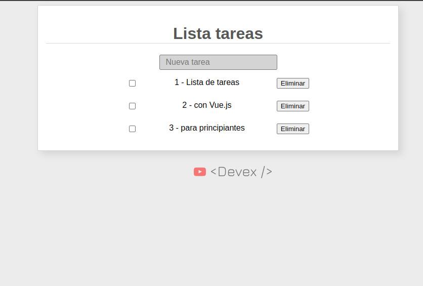

## Aplicación Web Simple de Lista de Tareas

Este repositorio contiene una aplicación web simple de Lista de Tareas construida utilizando HTML, CSS y Vue.js 3. La aplicación permite a los usuarios agregar tareas a una lista, marcarlas como completadas y eliminar tareas que ya no necesitan.



### Características

- Agrega nuevas tareas escribiendo en el campo de entrada y presionando "Enter".
- Marca las tareas como completadas marcando las casillas junto a ellas.
- Elimina tareas haciendo clic en el botón "Eliminar" al lado de cada tarea.

### Uso

1. Clona el repositorio en tu máquina local utilizando el siguiente comando:

   ```
   git clone https://github.com/Isc-mntl-snchz/Tutoriales-Vuejs.git
   ```

2. Abre el archivo `index.html` en un navegador web para ver la aplicación de Lista de Tareas en acción.

### Explicación del Código

El código está organizado de la siguiente manera:

- **HTML:** La estructura de la página web, incluyendo el campo de entrada para agregar nuevas tareas y la visualización de la lista de tareas.
- **CSS:** Estilos para que la aplicación sea visualmente atractiva y fácil de usar.
- **JavaScript (Vue.js):** La funcionalidad de la aplicación está implementada utilizando Vue.js, un popular framework de JavaScript. Vue proporciona enlace de datos reactivos y manejo de eventos.

Aquí tienes un resumen breve del código de Vue.js:

- La aplicación Vue se crea usando `Vue.createApp()` y se monta en el elemento con el ID `app`.
- La función `setup()` contiene los datos reactivos y las funciones utilizadas en la aplicación.
- `listaTareasRef` es un arreglo reactivo que almacena la lista de tareas. Cada tarea es un objeto con las propiedades `texto` (descripción de la tarea) y `realizado` (estado de completitud de la tarea).
- `nuevaTareaRef` es una referencia que almacena el valor del campo de entrada para agregar nuevas tareas.
- `agregarTareaNueva()` es una función que agrega una nueva tarea a la lista cuando se presiona la tecla "Enter". Verifica si el campo de entrada está vacío antes de agregar.
- `eliminarTarea(index)` es una función que permite a los usuarios eliminar una tarea al hacer clic en el botón "Eliminar". Confirma la intención del usuario antes de eliminar la tarea.

### Ejecutar la Aplicación

Para ejecutar la aplicación en tu máquina local, simplemente abre el archivo `index.html` en un navegador web. También puedes implementar la aplicación en un servicio de alojamiento web para compartirla con otros.

Siéntete libre de personalizar y mejorar la aplicación a medida que aprendas más sobre desarrollo web y Vue.js. ¡Feliz codificación!
